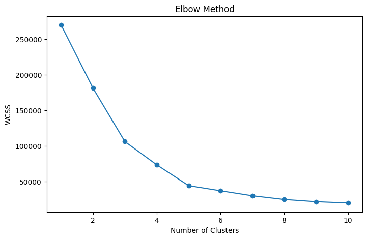
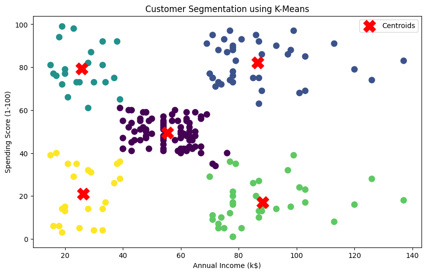

# Customer Segmentation Using K-Means Clustering

## Overview

Customer segmentation is a powerful business strategy that helps organizations understand customer behavior and create targeted marketing campaigns. This project applies the K-Means Clustering algorithm to segment mall customers based on their annual income and spending score.

The objective is to identify distinct customer groups and generate meaningful business insights that can support marketing decisions and improve customer engagement.

---

## Dataset Information

**Dataset:** Mall Customer Segmentation Dataset

The dataset contains the following attributes:

- Customer ID
- Gender
- Age
- Annual Income (k$)
- Spending Score (1-100)

The dataset is widely used for customer behavior analysis and clustering applications.

---

## Technologies Used

- Python
- Pandas
- NumPy
- Matplotlib
- Seaborn
- Scikit-Learn
- Google Colab

---

## Project Workflow

### 1. Data Loading
- Imported the dataset using Pandas.
- Examined the dataset structure and features.

### 2. Data Cleaning
- Checked for missing values.
- Checked for duplicate records.
- Verified data quality before analysis.

### 3. Exploratory Data Analysis (EDA)
Performed visual analysis using:
- Gender Distribution
- Age Distribution
- Annual Income Distribution
- Spending Score Distribution
- Income vs Spending Score Relationship

### 4. Feature Selection
Selected the following features for clustering:
- Annual Income (k$)
- Spending Score (1-100)

### 5. Elbow Method
Applied the Elbow Method to determine the optimal number of clusters.

Result:
- Optimal number of clusters = **5**

### 6. K-Means Clustering
Applied the K-Means Clustering algorithm and grouped customers into five distinct segments.

### 7. Cluster Analysis
Analyzed each cluster based on income and spending behavior to generate business insights.

---

## Visualizations

### Elbow Method



### Customer Segmentation



---

## Customer Segments Identified

### Premium Customers
- High Income
- High Spending
- Most valuable customer segment

### Careful Customers
- High Income
- Low Spending
- Potential target for personalized marketing

### Impulsive Customers
- Low Income
- High Spending
- Frequent buyers despite lower income

### Budget Customers
- Low Income
- Low Spending
- More responsive to discounts and offers

### Regular Customers
- Average Income
- Average Spending
- Stable and consistent customer group

---

## Key Insights

- Five distinct customer groups were successfully identified.
- Premium customers contribute significantly to business value.
- High-income customers with low spending behavior represent an untapped opportunity.
- Budget customers can be targeted through promotional campaigns.
- Regular customers form the foundation of recurring revenue.
- Customer segmentation enables businesses to create personalized marketing strategies.

---

## Results

The K-Means Clustering algorithm successfully segmented customers into meaningful groups based on purchasing behavior and income levels.

The generated segments can help businesses:

- Improve customer targeting
- Design personalized marketing campaigns
- Increase customer satisfaction
- Enhance customer retention
- Improve overall profitability

---

## Conclusion

This project demonstrates the practical application of unsupervised machine learning for solving real-world business problems.

By applying K-Means Clustering, customers were grouped into distinct segments based on income and spending behavior. The resulting insights can help businesses make data-driven decisions and optimize their marketing strategies.

---

## Repository Structure

```text
synent-task6-customersegmentation-vivek

├── customer_segmentation.ipynb
├── README.md
├── Mall_Customers.csv
├── elbow_method.png
└── customer_segmentation.png
```

---

## Author

**Vivek**  
Data Science Internship Project – Synent Technologies
